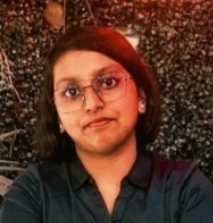
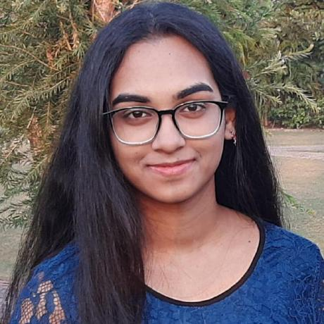

 

 

  
  

<!--  [Visit Here!](https://www.samarthtmsl.live/) -->
<h2 align="centre" > <a href="https://new-website-zeta.vercel.app/"> Visit Here</h2>
  
# 💫Members of the Tech Team ->

# :man_technologist: Head
<table><tbody><tr>

 <td align="center"><a href="https://www.linkedin.com/in/soumojit-ghatak-378562248/" target="_blank"  rel="nofollow"> Soumojit Ghatak</a> </td>

</table>

 

# :man_technologist: Co-Heads
<table><tbody><tr>
<td align="center"><a href="https://github.com/LoNeWoLf003" target="_blank" rel="nofollow"> Sayak Sengupta</a> </td>
  <td align="center"><a href="https://github.com/codingniket" target="_blank" rel="nofollow"> Niket Bachawat</a> </td>

</table>

  
# :atom_symbol: Development Team
<table><tbody><tr>
  
  
  <td align="center"><a href="https://github.com/Shinjan-saha" target="_blank" rel="nofollow"> Shinjan Saha</a> </td>

  <td align="center"><a href="https://github.com/SatyakiDey75" target="_blank" rel="nofollow"> Satyaki Dey</a> </td>

   <td align="center"><a href="https://github.com/iam-ravi-12" target="_blank" rel="nofollow"> Ravi Ranjan Kumar </a> </td>

  <td align="center"><a href="https://github.com/sattwikeeg100" target="_blank" rel="nofollow">  Sattwikee Ghosh </a> </td>

   <td align="center"><a href="https://github.com/Sonika12Biswas" target="_blank" rel="nofollow"> Sonika Biswas</a> </td>

   
 </tr></tbody></table>

 

 
:biohazard: Languages We Work On:-

 
<i> Thank you for visiting !</i>

