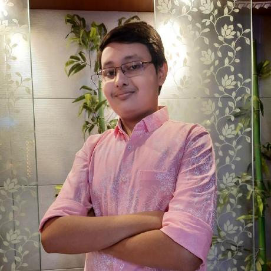

 

 

  
  

<!--  [Visit Here!](https://www.samarthtmsl.live/) -->
<h2 align="centre" > <a href="https://www.samarthtmsl.live/"> Visit Here</h2>
  
# 💫Members of the Tech Team ->

# :man_technologist: Head
<table><tbody><tr>

<td align="center"><a href="https://github.com/LoNeWoLf003" target="_blank" rel="nofollow"> Sayak Sengupta</a> </td>

</table>

 

# :man_technologist: Co-Heads
<table><tbody><tr>
 <td align="center"><a href="https://github.com/SatyakiDey75" target="_blank" rel="nofollow"> Satyaki Dey</a> </td>

   <td align="center"><a href="https://github.com/iam-ravi-12" target="_blank" rel="nofollow"> Ravi Ranjan Kumar </a> </td>

</table>

  
# :atom_symbol: Development Team
<table><tbody><tr>
  
  <td align="center"><a href="https://github.com/anirban12x" target="_blank" rel="nofollow"> Anirban Bandyopadhyay</a> </td>

  <td align="center"><a href="https://github.com/darkhorse404" target="_blank" rel="nofollow"> Priyobrata Mondal</a> </td>

   <td align="center"><a href="https://github.com/SujayDeyTMSL" target="_blank" rel="nofollow"> Sujay Dey</a> </td>

   <td align="center"><a href="https://github.com/Sapta-Dev27" target="_blank" rel="nofollow"> Saptarshi Paul</a> </td>

  <td align="center"><a href="https://github.com/Anish-2005" target="_blank" rel="nofollow"> Anish Seth</a> </td>

  <td align="center"><a href="https://github.com/d3basmi1a" target="_blank" rel="nofollow"> Debasmita Mondal</a> </td>
   
 </tr></tbody></table>

 

 
  
## :biohazard: Languages We Work On:-

 
<i> Thank you for visiting !</i>

